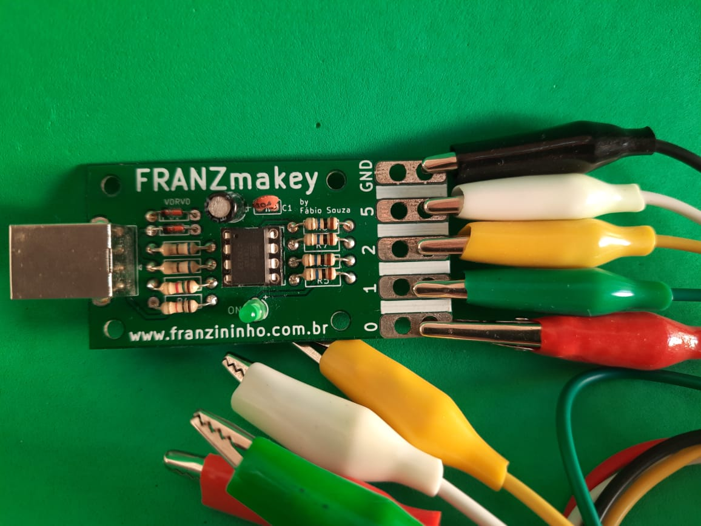

# FranzMakey

FRANZmakey é um kit com funcionamento similar ao Makey Makey, porém com um custo bem mais acessível e é feito no Brasil. O objetivo dessa placa é possibilitar a interação com o computador através de objetos inusitados, como: frutas, legumes, etc, e assim estimular a criatividade com muita mão na massa e o pensamento computacional através da programação no Scratch.

Placa FranzMakey

Com esse kit você pode colocar a criatividade e mão na massa para funcionar, você pode criar um controle para controlar os controlar jogos no Scartch, animar personagens no Scratch tocando em frutas, criar narrativas, fazer músicas tocando em frutas e etc.

# Documentação

[Documentação do FranzMakey](https://franzininho.github.io/docs-franzininho-site/docs/FranzMakey/franzmakey)

# Onde comprar?

Esse kit é feito sob encomenda. Para adquiri-lo, entre em contato conosco: contato@franzininho.com.br
